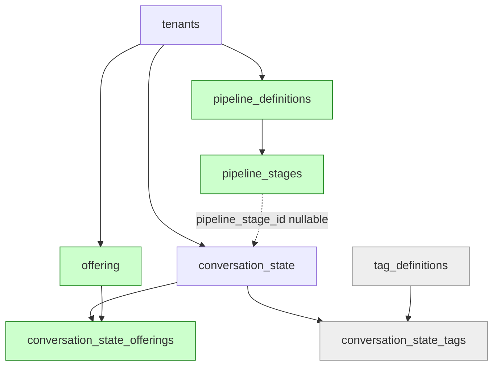

# Phase 16.5A6 — Enterprise Backfill Runbook

**Status:** DESIGN COMPLETE — not implemented. Produced by the Phase 16.5A6-P
readiness audit. Every architectural decision is locked here so the implementation
phase writes code only.

> **Governance:** ADR-018 (`is_admitted` is independent — the backfill MUST NOT touch it)
> and ADR-019 (Compatibility Pipeline + exact Offering names) are binding.

---

## 1. The Fail-Safe Property (read this first)

The Phase 16.5A5-I adapters are **gated on `pipeline_stage_id`**:

```python
if self.pipeline_stage_id is not None:   # relationally activated
    ...read relational...
return self._legacy_column                # fallback
```

Therefore **any row this migration fails to migrate is automatically still correct.**
A row left with `pipeline_stage_id = NULL` reads exactly as it does today. There is no
partially-broken state: a row is either migrated-and-verified, or untouched-and-correct.

**Consequence:** when in doubt, the engine SKIPS. Never force a link. Every "unlinkable"
condition below resolves to "leave NULL", which is a safe outcome, not a failure.

---

## 2. Schema Audit

### 2.1 Tables in scope

| Table | PK | Tenant isolation | Unique constraints | FK (all `NO ACTION` — no CASCADE) | Indexes |
| :--- | :--- | :--- | :--- | :--- | :--- |
| `conversation_state` | `id` | `tenant_id` NOT NULL | `uq_conversation_state_phone_tenant (phone, tenant_id)` | `tenant_id`→`tenants.id`, `pipeline_stage_id`→`pipeline_stages.id` (nullable) | `ix_conversation_state_phone`, `ix_conversation_state_tenant_id`, `ix_conversation_state_pipeline_stage_id` |
| `pipeline_definitions` | `id` | `tenant_id` NOT NULL | `uq_pipeline_def_tenant_key (tenant_id, internal_key)` | `tenant_id`→`tenants.id` | `ix_pipeline_definitions_tenant_id` |
| `pipeline_stages` | `id` | **implicit** via `pipeline_id` | `uq_pipeline_stage_pipeline_key (pipeline_id, internal_key)` | `pipeline_id`→`pipeline_definitions.id` | `ix_pipeline_stages_pipeline_id`, `idx_pipeline_stage_active`, `idx_pipeline_stage_category` |
| `offering` | `id` | `tenant_id` NOT NULL | `uq_offering_tenant_key (tenant_id, internal_key)` ⚠️ **not `name`** | `tenant_id`→`tenants.id` | `ix_offering_tenant_id` |
| `conversation_state_offerings` | `id` | **implicit** via `conversation_state_id` | `uq_conv_offering (conversation_state_id, offering_id)` | `conversation_state_id`→`conversation_state.id`, `offering_id`→`offering.id` | both FKs indexed |
| `conversation_state_tags` | `id` | implicit | `uq_conv_tag` | → `conversation_state.id`, `tag_definitions.id` | both FKs indexed |
| `tenants` | `id` (uuid hex) | — | `slug` | — | PK |

### 2.2 Critical finding — `Offering` uniqueness gap

ADR-019 mandates deduplication on the **exact `name`**, but the only unique constraint is
`(tenant_id, internal_key)`. The schema therefore **cannot enforce** ADR-019's dedup rule.

**Locked resolution (no schema change):**
1. The engine is **single-threaded, one tenant at a time** — no concurrent inserts.
2. Idempotent lookup is **by `(tenant_id, name)` exact string**, not by `internal_key`.
3. `internal_key` collisions (distinct names slugging identically, e.g. `"Python"` /
   `"python"` → `python`) are resolved with a numeric suffix (`python_2`).
4. `uq_offering_tenant_key` acts as the crash-safety backstop: a duplicate insert raises
   rather than silently duplicating.

> A future `uq_offering_tenant_name` constraint would close this properly. It requires a
> migration and is **out of scope** for 16.5A6. Logged as technical debt.

### 2.3 Dependency graph



**Write order** = topological order: `pipeline_definitions` → `pipeline_stages` →
`offering` → `conversation_state_offerings` → `conversation_state.pipeline_stage_id`.
**Rollback order** = exact reverse (FKs have no CASCADE, so wrong order fails loudly —
this is a feature).

`conversation_state_tags` / `tag_definitions` are **NOT in scope** (lead_status→Tag
migration is deferred; see ADR-018 companion note). They remain empty.

### 2.4 Expected row growth

| Table | Rows added | Formula |
| :--- | :--- | :--- |
| `pipeline_definitions` | 1 per tenant with ≥1 lead | `T_active` |
| `pipeline_stages` | 12 + extras per tenant | `T_active × (12 + E_t)` |
| `offering` | 1 per distinct exact course per tenant | `Σ D_t` |
| `conversation_state_offerings` | 1 per lead with non-empty course | `≤ N` |
| `conversation_state` | **0 rows added** — `UPDATE` only | — |

---

## 3. Locked Design Parameters

**These are decisions, not suggestions. The implementation phase must not re-litigate them.**

### 3.1 Compatibility Pipeline (Step 1)

| Field | Value |
| :--- | :--- |
| `internal_key` | `legacy_compat` |
| `name` | `Legacy Compatibility Pipeline` |
| `description` | `Auto-generated by Phase 16.5A6. Preserves legacy router stage vocabulary (ADR-019). Do not rename stage internal_keys.` |
| `is_default` | `True` — **only if** the tenant has no existing default pipeline |
| `is_active` | `True` |
| Scope | Only tenants with **≥1 `conversation_state` row** |

### 3.2 Compatibility Stages (Step 2) — the canonical 12

Sourced from `app/state.py:130-134` + every `st["stage"] = ...` site in
`app/bot/router.py` / `app/bot/objections.py`. `internal_key` is the **exact legacy
string** (ADR-019) — never rename.

| # | `internal_key` | `display_name` | `stage_category` | `order_index` | `is_entry` | `is_terminal` |
| :-- | :--- | :--- | :--- | :-- | :-- | :-- |
| 0 | `new` | New | `open` | 0 | **True** | False |
| 1 | `goal_selection` | Goal Selection | `open` | 1 | False | False |
| 2 | `course_recommendation` | Course Recommendation | `open` | 2 | False | False |
| 3 | `course_viewed` | Course Viewed | `open` | 3 | False | False |
| 4 | `demo_time_ask` | Demo Time Requested | `open` | 4 | False | False |
| 5 | `demo_date_ask` | Demo Date Requested | `open` | 5 | False | False |
| 6 | `demo_booked` | Demo Booked | `open` | 6 | False | False |
| 7 | `offer_menu` | Offer Menu | `open` | 7 | False | False |
| 8 | `payment_pending` | Payment Pending | `open` | 8 | False | False |
| 9 | `enrolled` | Enrolled | **`won`** | 9 | False | **True** |
| 10 | `not_sure` | Not Sure | `open` | 10 | False | False |
| 11 | `done` | Done | `open` | 11 | False | **True** |

**Locked rationale:**
- **`stage_category`**: only `enrolled` = `won`. Everything else `open`. Per ADR-018 this
  is informational and cannot affect `is_admitted`. Deliberately conservative — `done` /
  `not_sure` are **not** marked `lost`, because `lost` may later drive campaign
  suppression, which would be a behaviour change. Refining categories is a future
  tenant-configuration decision, not a migration decision.
- **`is_terminal`**: informational. **Nothing reads it today** (verified: no route,
  service, or worker references `is_terminal`).
- **`is_entry` on `new`**: correct for *future* new-lead assignment.
  ⚠️ **Hazard:** `PipelineStage`'s docstring says `is_entry` is "used by adapters to
  auto-assign ConversationState records when `pipeline_stage_id` is NULL". The
  16.5A5-I adapters do **not** auto-assign, and **must never** be changed to do so for
  *existing* rows — a row with legacy `stage=''` auto-assigned to `new` would flip its
  read from `''` to `'new'`. Any future auto-assign applies to newly created rows only.

### 3.3 Extra / unlinkable stage values

Production may hold `stage` values outside the canonical 12 (legacy data, removed flows).

| Condition | Action |
| :--- | :--- |
| Distinct value matches `^[a-z0-9_]+$` and is not canonical | **Seed an extra stage** for that tenant: `internal_key` = exact value, `display_name` = value, `stage_category='open'`, `order_index` = 100+n, flags False |
| Distinct value **violates** `^[a-z0-9_]+$` (e.g. `"Demo Booked"`) | **DO NOT seed. DO NOT link.** Leave `pipeline_stage_id = NULL` → adapter falls back → parity preserved. Report as `unlinkable_rows`. **Never relax the frozen regex without an ADR.** |
| `stage IS NULL` or `stage = ''` | **DO NOT link.** Leave NULL. Linking to `new` would flip the read from `''`→`'new'`. |

### 3.4 Offering identity (Step 3) — ADR-019

- `name` = **exact** legacy `course` string. No trim, no case-fold, no normalization.
- Dedup key = exact `(tenant_id, name)`.
- `internal_key` = `slugify(name)`, collision-suffixed:

```
slugify(s):
  t = s.lower()
  t = re.sub(r'[^a-z0-9]+', '_', t)
  t = t.strip('_')[:50].rstrip('_')
  return t or 'offering'

collision: base, base_2, base_3, ... (checked within tenant, max 50 chars)
```

- `is_active=True`; `price=NULL` (unknown — nullable per ADR-016/Freeze v1.2);
  `custom_attributes=NULL`.
- Source set: `SELECT DISTINCT course WHERE course IS NOT NULL AND course <> ''`.

### 3.5 Execution parameters

| Parameter | Value |
| :--- | :--- |
| Batch size | **500** rows (matches Migration Strategy v1.0 §batching) |
| Concurrency | **Single-threaded**, one tenant at a time (§2.2 requires it) |
| Transaction boundary | **One commit per batch** |
| Isolation | Every query filtered by `tenant_id`; stage lookups scoped by `pipeline_id` |
| Ordering | `ORDER BY id` with `id > last_seen` keyset pagination (**not** `OFFSET`) |
| Idempotency | Skip-if-exists on every write (see §4) |

---

## 4. Step-by-Step Execution Plan

Each step: Purpose · Input · Output · Skip · Failure · Retry · Rollback · Audit.

### Step 1 — Compatibility Pipeline creation

| Aspect | Detail |
| :--- | :--- |
| **Purpose** | One `legacy_compat` pipeline per active tenant |
| **Input** | `SELECT DISTINCT tenant_id FROM conversation_state` |
| **Output** | ≤1 `pipeline_definitions` row per tenant |
| **Skip** | `WHERE tenant_id=? AND internal_key='legacy_compat'` exists → reuse id |
| **Failure** | `uq_pipeline_def_tenant_key` violation → another run created it → re-SELECT and reuse. FK violation on `tenant_id` → orphan lead; abort tenant, report |
| **Retry** | ✅ Safe (idempotent) |
| **Rollback** | `DELETE` where `internal_key='legacy_compat'` — only after Step 2 rollback |
| **Audit** | `pipelines_created`, `pipelines_reused` |

### Step 2 — Compatibility Stage creation

| Aspect | Detail |
| :--- | :--- |
| **Purpose** | Seed the 12 canonical stages + regex-valid extras |
| **Input** | Step 1 `pipeline_id`; `SELECT DISTINCT stage FROM conversation_state WHERE tenant_id=?` |
| **Output** | 12 + `E_t` `pipeline_stages` rows |
| **Skip** | `WHERE pipeline_id=? AND internal_key=?` exists → reuse |
| **Failure** | `uq_pipeline_stage_pipeline_key` violation → reuse. `is_entry` duplicate → app-layer only, log warning |
| **Retry** | ✅ Safe |
| **Rollback** | `DELETE FROM pipeline_stages WHERE pipeline_id=?` — only after Step 5 rollback (FK) |
| **Audit** | `stages_created`, `stages_reused`, `extra_stages_seeded`, `unlinkable_stage_values[]` |

### Step 3 — Offering creation

| Aspect | Detail |
| :--- | :--- |
| **Purpose** | One Offering per distinct exact course string per tenant |
| **Input** | `SELECT DISTINCT course FROM conversation_state WHERE tenant_id=? AND course <> ''` |
| **Output** | `D_t` `offering` rows |
| **Skip** | `WHERE tenant_id=? AND name=?` (**exact**) exists → reuse id |
| **Failure** | `uq_offering_tenant_key` violation → slug collision → increment suffix and retry (bounded, 100 attempts) → else abort tenant. `course` >200 chars → impossible (`String(200)` source) |
| **Retry** | ✅ Safe |
| **Rollback** | `DELETE FROM offering WHERE tenant_id=? AND id NOT IN (SELECT offering_id FROM conversation_state_offerings)` — after Step 4 rollback |
| **Audit** | `offerings_created`, `offerings_reused`, `slug_collisions_resolved` |

### Step 4 — ConversationOffering bridges

| Aspect | Detail |
| :--- | :--- |
| **Purpose** | Link each lead to the Offering matching its exact course |
| **Input** | Batch of `conversation_state` where `course <> ''`; in-memory `{name → offering_id}` map (preloaded per tenant — **prevents N+1**) |
| **Output** | ≤1 bridge row per lead |
| **Skip** | `uq_conv_offering` pair exists → skip. Preload existing pairs for the batch in **one** query |
| **Failure** | Unique violation → concurrent/rerun → skip. FK violation → lead deleted mid-run → skip row, continue |
| **Retry** | ✅ Safe |
| **Rollback** | `DELETE FROM conversation_state_offerings WHERE conversation_state_id IN (tenant leads)` — safe: every bridge belongs to a row this backfill linked. **AMENDED (ADR-020):** `_sync_offering_link` is no longer a no-op, so the bot may create/repoint/remove bridges — but only while `pipeline_stage_id IS NOT NULL`. Unlink (Step 5 rollback) first, which makes the hook inert, then delete. |
| **Audit** | `bridges_created`, `bridges_skipped` |
| **Note** | Runs **before** Step 5 so that when the gate opens the bridge already exists. Either order is safe (missing bridge → `_first_offering()` returns None → legacy fallback). |
| **⚠️ ADR-020** | Step 4 correctness now depends on `_sync_offering_link` being implemented. With the pre-16.5A6-J no-op, Step 5 opening the gate caused `course` to return a **stale** `Offering.name` on the next bot course-write — undetectable by Step 7 (see §7 note). Do not run this backfill against a build lacking ADR-020. |

### Step 5 — `pipeline_stage_id` mapping ⚠️ the activating step

| Aspect | Detail |
| :--- | :--- |
| **Purpose** | Link `pipeline_stage_id` from legacy `stage` **ONLY** |
| **Input** | Batch of leads; in-memory `{internal_key → stage_id}` map (preloaded per tenant) |
| **Output** | `UPDATE conversation_state SET pipeline_stage_id=?` |
| **Skip** | `pipeline_stage_id IS NOT NULL` → already migrated → skip. `stage` NULL/`''`/unlinkable → **leave NULL** (§3.3) |
| **🚫 FORBIDDEN** | **MUST NOT read or write `is_admitted`** (ADR-018). Any reference to `is_admitted` or `stage_category` in this step is a defect. |
| **Failure** | FK violation → stage deleted → abort tenant. Value not in map → leave NULL, count as unlinkable |
| **Retry** | ✅ Safe (skip-if-not-null) |
| **Rollback** | `UPDATE conversation_state SET pipeline_stage_id=NULL WHERE pipeline_stage_id IN (SELECT id FROM pipeline_stages WHERE pipeline_id=<legacy_compat>)` — **scoped to compat stages only**; legacy columns untouched |
| **Audit** | `rows_linked`, `rows_skipped_already`, `rows_unlinkable` |

### Step 6 — `custom_attributes` enrichment

| Aspect | Detail |
| :--- | :--- |
| **Purpose** | Mirror `offer_course` / `batch_time` into the JSON blob |
| **Input** | Batch of leads with non-empty `offer_course` or `batch_time` |
| **Output** | `UPDATE conversation_state SET custom_attributes=?` |
| **Skip** | **Key already present → PRESERVE, never overwrite.** ⚠️ `custom_attributes` is **NOT uniformly NULL** — since the 16.5A5-I deploy the bot's setters have been writing live JSON. Merge, don't replace. |
| **Rule** | Write only non-empty values (mirrors `_set_custom_attr`). Reassign a new dict (JSON is not `Mutable` — in-place mutation won't flag dirty). Empty → leave/keep NULL. |
| **Failure** | Malformed pre-existing JSON → skip row, report (cannot occur via `db.JSON`) |
| **Retry** | ✅ Safe (merge is idempotent) |
| **Rollback** | **NO-OP by design.** The adapter reads JSON-first, and the written value is byte-identical to the legacy column, so leaving it is read-identical. Deleting keys would risk destroying live bot writes that are indistinguishable from backfilled ones. Documented, deliberate. |
| **Audit** | `attrs_enriched`, `attrs_preserved` |

### Step 7 — Validation audit

| Aspect | Detail |
| :--- | :--- |
| **Purpose** | Prove 100% parity |
| **Input** | Pre-migration legacy snapshot (captured **before** Step 5) |
| **Method** | For every migrated row compare adapter read vs snapshot: `stage`, `course`, `offer_course`, `batch_time`, `is_admitted` |
| **Pass** | 100% identical. **Any mismatch → immediate rollback** |
| **Failure** | Mismatch → halt, do not continue to next tenant, execute Rollback Checklist |
| **Audit** | `rows_verified`, `mismatches[]` |

---

## 5. Failure Matrix

| # | Failure | Impact | Recovery | Rollback needed | Retry safe | Manual? |
| :-- | :--- | :--- | :--- | :--- | :--- | :--- |
| F1 | Unique violation (pipeline/stage/offering/bridge) | None — row exists | Re-SELECT, reuse | No | ✅ | No |
| F2 | Slug collision exhausts suffixes (>100) | Tenant aborted | Inspect course strings | No | ✅ | Yes |
| F3 | Stage value violates `internal_key` regex | Rows stay NULL → **read-correct** | Report `unlinkable_rows`; ADR if linking desired | No | ✅ | Decide later |
| F4 | Orphan `tenant_id` (no `tenants` row) | Tenant aborted at Step 1 | Data-integrity fix first | No | ✅ | Yes |
| F5 | Lead deleted mid-run (FK violation, Step 4/5) | Single row skipped | Continue; next run picks up | No | ✅ | No |
| F6 | Connection drop mid-batch | Batch rolled back by txn | Restart — keyset resumes | No | ✅ | No |
| F7 | Step 7 parity mismatch | **CRITICAL** | **Halt + full rollback** | ✅ **Yes** | ❌ | **Yes** |
| F8 | Bot writes concurrently during run | Legacy col + link updated by setter | Benign — setter dual-writes; next run reconciles | No | ✅ | No |
| F9 | Pre-existing non-compat pipeline w/ `is_default=True` | `is_default` left False | By design (§3.1) | No | ✅ | No |
| F10 | Disk/quota exhaustion | Batch fails | Free space, restart | No | ✅ | Yes |

**F8 detail (concurrency):** the migration is safe to run **online**. If the bot writes
`st["stage"]="demo_booked"` mid-migration, the 16.5A5-I setter writes the legacy column
and, if the row is already linked, syncs the link by exact `internal_key`. Both paths stay
consistent. **No downtime and no maintenance window is required.**

---

## 6. Rollback Matrix

Execute in **reverse order**. No FK has CASCADE, so a wrong order fails loudly rather than
destroying data.

| Order | Step | Action | Legacy data touched |
| :-- | :--- | :--- | :--- |
| 1 | Step 6 | **NO-OP** (§Step 6 rationale) | None |
| 2 | Step 5 | `UPDATE conversation_state SET pipeline_stage_id=NULL` where stage ∈ compat pipeline | **None** |
| 3 | Step 4 | `DELETE FROM conversation_state_offerings` for tenant leads | **None** |
| 4 | Step 3 | `DELETE FROM offering` for tenant where unreferenced | **None** |
| 5 | Step 2 | `DELETE FROM pipeline_stages WHERE pipeline_id=<legacy_compat>` | **None** |
| 6 | Step 1 | `DELETE FROM pipeline_definitions WHERE internal_key='legacy_compat'` | **None** |

**Guarantee:** rollback removes only enterprise structures created by the backfill.
`stage`, `course`, `offer_course`, `batch_time`, `is_admitted`, `lead_status` are **never
written by the backfill and never touched by rollback**. Post-rollback, every row has
`pipeline_stage_id = NULL` → adapters fall back → the system is byte-identical to today.

---

## 7. Validation Matrix

| # | Check | Method | Pass |
| :-- | :--- | :--- | :--- |
| V1 | Row parity | `COUNT(*)` before == after | Equal (backfill adds **0** leads) |
| V2 | Stage parity | adapter `stage` == snapshot per row | 100% |
| V3 | Course parity | adapter `course` == snapshot | 100% |
| V4 | Offer parity | adapter `offer_course` == snapshot | 100% |
| V5 | Batch-time parity | adapter `batch_time` == snapshot | 100% |
| V6 | **`is_admitted` parity** | `COUNT(is_admitted=true)` before == after | **Exactly equal** (ADR-018 — must be untouched) |
| V7 | Analytics parity | `admin.py:550`, `:4400` admissions; `get_stage_breakdown()` | Identical |
| V8 | Router compat | every linked row: `internal_key` == legacy `stage` | 100% |
| V9 | Scheduler compat | `follow_up_jobs` query unaffected | No change (no coupling) |
| V10 | Tenant isolation | no bridge/link crosses tenants (see SQL below) | 0 rows |
| V11 | Idempotency | run twice → 2nd run reports 0 creates, 0 links | 0 deltas |

> ⚠️ **Known blind spot in this matrix (ADR-020).** Every check above is evaluated
> *at migration time*. A bridge-backed adapter whose write hook does not resync
> passes all of them and then corrupts data on the **next** bot write. This is
> exactly how the `course` defect (Phase 16.5A6-LA) evaded V2–V8. Parity proves the
> migration was faithful; it does **not** prove the adapters are sound. Adapter
> write-path correctness must be established separately — see
> `tests/test_adapter_sync_16_5a6j.py`.

### V10 — cross-tenant leak detector (must return 0)

```sql
-- Lead linked to a stage belonging to ANOTHER tenant's pipeline
SELECT COUNT(*) FROM conversation_state cs
JOIN pipeline_stages ps      ON ps.id = cs.pipeline_stage_id
JOIN pipeline_definitions pd ON pd.id = ps.pipeline_id
WHERE pd.tenant_id <> cs.tenant_id;

-- Lead bridged to ANOTHER tenant's offering
SELECT COUNT(*) FROM conversation_state_offerings b
JOIN conversation_state cs ON cs.id = b.conversation_state_id
JOIN offering o            ON o.id  = b.offering_id
WHERE o.tenant_id <> cs.tenant_id;
```

---

## 8. Performance Estimate

Parametric — `N` = leads, `T_active` = tenants with leads, `D_t` = distinct courses/tenant.

| Metric | Estimate |
| :--- | :--- |
| Batch size | 500 |
| Queries per batch | **~5** (keyset SELECT, bridge-pair preload, UPDATEs, COMMIT). Stage/Offering maps preloaded **once per tenant** → **no N+1** |
| Total queries | `≈ 5 × ⌈N/500⌉ + T_active × (3 + 12 + D_t)` |
| Memory | ~0.5–1 MB per batch (500 ORM rows) + maps (12 stages + `D_t` offerings) → **< 10 MB steady** |
| Transaction | 1 commit / batch → txn holds ≤500 row locks, ~50–200 ms |
| Lock duration | **Row-level only**, released per batch. **No DDL, no table lock, no `ACCESS EXCLUSIVE`** |
| Runtime | `≈ ⌈N/500⌉ × 0.15 s`. N=10k → **~3 s**; N=100k → **~30 s**; N=1M → **~5 min** |
| Downtime | **None** — safe online (see F8) |
| Tenant scaling | Linear in `T_active`; per-tenant cost `O(12 + D_t)` + `O(N_t)` |

> ⚠️ These are **model-based, not measured** — production row counts are unknown (§10).
> Re-derive after running the §9 discovery SQL.

---

## 9. Required Production Discovery (READ-ONLY)

**Blocking.** The dev environment has **no production DB access** (`.env` absent;
`local_migration_test.db` is 0 bytes). Run these **read-only** queries on the Railway
production replica and record the output before implementing.

```sql
-- D1 Volume ------------------------------------------------------------------
SELECT COUNT(*) AS total_leads FROM conversation_state;
SELECT tenant_id, COUNT(*) FROM conversation_state GROUP BY tenant_id ORDER BY 2 DESC;

-- D2 Stage vocabulary (CRITICAL — reveals values outside the canonical 12) -----
SELECT tenant_id, stage, COUNT(*) FROM conversation_state
GROUP BY tenant_id, stage ORDER BY tenant_id, 3 DESC;

-- D3 Unlinkable stages (violate internal_key regex -> stay NULL, §3.3) --------
SELECT DISTINCT stage FROM conversation_state
WHERE stage IS NOT NULL AND stage <> '' AND stage !~ '^[a-z0-9_]+$';
SELECT COUNT(*) AS null_or_empty_stage FROM conversation_state
WHERE stage IS NULL OR stage = '';

-- D4 is_admitted baseline (V6 audit anchor — must be unchanged after backfill) -
SELECT COUNT(*) FILTER (WHERE is_admitted) AS admitted_total FROM conversation_state;

-- D5 ADR-018 census — quantifies what the ORIGINAL design would have broken ----
SELECT COUNT(*) AS would_have_been_erased
FROM conversation_state WHERE is_admitted = true AND stage IS DISTINCT FROM 'enrolled';
SELECT COUNT(*) AS would_have_been_phantom
FROM conversation_state WHERE is_admitted IS NOT TRUE AND stage = 'enrolled';

-- D6 Offering volume + slug-collision census (ADR-019 justification) ----------
SELECT tenant_id, COUNT(DISTINCT course) FROM conversation_state
WHERE course IS NOT NULL AND course <> '' GROUP BY tenant_id;
SELECT tenant_id, lower(course) AS slug_base, COUNT(DISTINCT course) AS distinct_names
FROM conversation_state WHERE course IS NOT NULL AND course <> ''
GROUP BY tenant_id, lower(course) HAVING COUNT(DISTINCT course) > 1;
   -- ^ >0 rows = slug dedup WOULD have corrupted data. Confirms ADR-019.
SELECT COUNT(DISTINCT course) FROM conversation_state WHERE length(course) > 50;
   -- ^ internal_key truncation/collision candidates

-- D7 Idempotency + live-JSON baseline ----------------------------------------
SELECT COUNT(*) FROM conversation_state WHERE pipeline_stage_id IS NOT NULL;  -- expect 0
SELECT COUNT(*) FROM conversation_state WHERE custom_attributes IS NOT NULL;  -- may be >0
SELECT COUNT(*) FROM pipeline_definitions; SELECT COUNT(*) FROM pipeline_stages;
SELECT COUNT(*) FROM offering;             SELECT COUNT(*) FROM conversation_state_offerings;

-- D8 Referential integrity ---------------------------------------------------
SELECT COUNT(*) AS orphan_leads FROM conversation_state cs
LEFT JOIN tenants t ON t.id = cs.tenant_id WHERE t.id IS NULL;
```

**Decision gates from discovery**

| Result | Consequence |
| :--- | :--- |
| D3 returns rows | Those leads stay NULL (safe). Note count in the report. |
| D6 collision query returns rows | ADR-019 empirically confirmed; suffix logic **will** trigger. |
| D7 `pipeline_stage_id IS NOT NULL` > 0 | Unexpected — investigate before running. |
| D8 `orphan_leads` > 0 | **Fix before running** (F4). |

---

## 10. Production Readiness Score

| Dimension | Score | Notes |
| :--- | :--- | :--- |
| Architecture | **10/10** | ADR-018/019 ratified; adapters corrected & tested |
| Idempotency | **10/10** | Skip-if-exists on every write; keyset pagination |
| Rollback | **10/10** | Reverse-order, legacy never touched, no CASCADE |
| Tenant safety | **10/10** | Every query tenant-scoped; V10 leak detector |
| Failure handling | **9/10** | 10 modes mapped; F7 requires manual rollback (correct) |
| Performance | **8/10** | No N+1, batched, online-safe — but **unmeasured** (§9) |
| Fail-safe design | **10/10** | Unmigrated row == correct row |
| **Data discovery** | **0/10** | ❌ **No production access — blocking** |
| **Overall** | **77/100** | **CONDITIONAL GO** |

---

## 11. Remaining Risks

| # | Risk | Severity | Mitigation |
| :-- | :--- | :--- | :--- |
| R1 | **Production row counts unknown** | **HIGH** | Run §9 discovery. Blocks GO. |
| R2 | Unknown stage values outside the 12 | MEDIUM | D2/D3 reveal; unlinkable → NULL → safe |
| R3 | `Offering` lacks `uq(tenant_id, name)` | MEDIUM | Single-threaded + lookup-by-name; debt logged |
| R4 | Slug collisions on `internal_key` | LOW | Suffix logic; D6 quantifies |
| R5 | `custom_attributes` holds live bot JSON | LOW | Step 6 merges, never overwrites |
| R6 | Future `is_entry` auto-assign flips `''`→`'new'` | LOW | Documented hazard (§3.2); adapters must not auto-assign existing rows |
| R7 | Step 7 snapshot cost on very large N | LOW | Snapshot per tenant, not globally |
| R8 | **`course` returns a stale Offering after backfill** | ~~**CRITICAL**~~ **RESOLVED** | Found by Phase 16.5A6-LA; fixed by **ADR-020** (symmetric `_sync_offering_link`). Backfill MUST NOT run against a build lacking ADR-020. Verified by 30 mutation checks. |
| R9 | Another bridge-backed adapter ships without a write hook | MEDIUM | Freeze v1.3 now requires a write contract in the §7 matrix for any link-resolving adapter |

---

## 12. GO / NO-GO

### ⚠️ CONDITIONAL GO

**The design is complete and requires no further architectural decisions.** Every
parameter is locked in §3, every step specified in §4, failure/rollback/validation fully
mapped.

**One blocking precondition:** execute the §9 read-only discovery on production and record
the results. Two outcomes gate implementation:

- `D8 orphan_leads > 0` → **NO-GO** until data integrity is fixed.
- `D7 pipeline_stage_id IS NOT NULL > 0` → **NO-GO** pending investigation.

All other discovery outcomes are informational and do not change the design.

**No production data was read or modified by this audit.**

---

## References
- ADR-018 Business Conversion Independence
- ADR-019 Compatibility Pipeline Standard
- Enterprise Data Model Freeze v1.2
- `OXFORD_CRM_ENTERPRISE_DATABASE_MIGRATION_STRATEGY_v1.0.md`
- Phase 16.5A5-I / 16.5A5-J implementation reports
